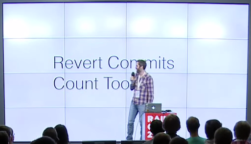

# Juckbuzz treasury

http://jukebuzz.r14.railsrumble.com

Earn coins :moneybag: :moneybag: :moneybag: on #railsrumble room for commits.

### 1 commit = 1 coin

## Coins earning

1. Fork it
2. Create your feature branch (`git checkout -b give-me-some-coins`)
3. Create in [treasure_hunters](treasure_hunters/) directory file with name like you github username and any content.
3. Commit your changes (`git commit -am 'Commit for coins'`)
4. Push to the branch (`git push origin give-me-some-coins`)
5. Create new Pull Request

## And do not forget!

## Vote for us
You can [vote for us](http://railsrumble.com/?view=http://jukebuzz.r14.railsrumble.com/) in the [2014 Rails Rumble](http://railsrumble.com/)!
